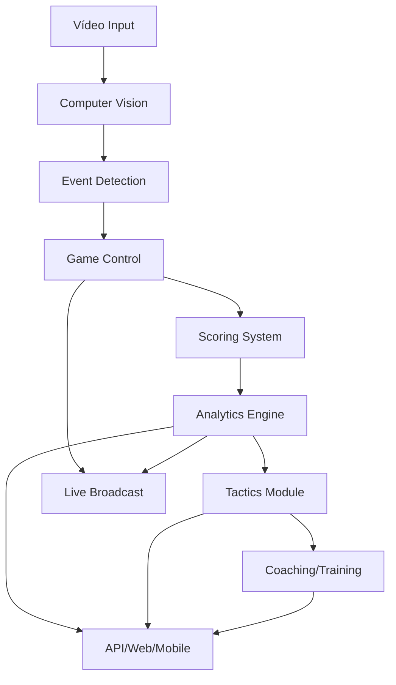

# Estrutura Orientada ao Domínio do Tênis 🎾

## Nova Arquitetura Focada em Análise e Gestão de Partidas

```
tennis-analytics/
│
├── src/
│   ├── __init__.py
│   ├── app.py                           # Aplicação principal
│   │
│   ├── game_control/                    # 🎮 CONTROLE DE JOGOS
│   │   ├── __init__.py
│   │   ├── match_manager.py             # Gerenciador de partidas
│   │   ├── set_controller.py            # Controle de sets
│   │   ├── game_controller.py           # Controle de games
│   │   ├── rally_tracker.py             # Rastreamento de rallies
│   │   ├── serve_analyzer.py            # Análise de saques
│   │   └── models/
│   │       ├── match.py                 # Modelo de partida
│   │       ├── player.py                # Modelo de jogador
│   │       └── court.py                 # Modelo de quadra
│   │
│   ├── scoring/                         # 📊 CONTROLE DE PONTOS
│   │   ├── __init__.py
│   │   ├── score_manager.py             # Gerenciador de pontuação
│   │   ├── point_tracker.py             # Rastreador de pontos
│   │   ├── scoring_rules.py             # Regras de pontuação (ATP/WTA)
│   │   ├── tiebreak_handler.py          # Tratamento de tie-breaks
│   │   ├── advantage_system.py          # Sistema de vantagens
│   │   └── models/
│   │       ├── scoreboard.py            # Modelo de placar
│   │       └── point_history.py         # Histórico de pontos
│   │
│   ├── analytics/                       # 📈 ANÁLISES E ESTATÍSTICAS
│   │   ├── __init__.py
│   │   ├── performance_analyzer.py      # Análise de desempenho
│   │   ├── statistics_engine.py         # Motor de estatísticas
│   │   ├── heatmap_generator.py         # Gerador de mapas de calor
│   │   ├── shot_analyzer.py             # Análise de golpes
│   │   ├── movement_analyzer.py         # Análise de movimentação
│   │   ├── fatigue_detector.py          # Detecção de fadiga
│   │   ├── momentum_tracker.py          # Rastreamento de momentum
│   │   └── reports/
│   │       ├── match_report.py          # Relatório de partida
│   │       ├── player_report.py         # Relatório de jogador
│   │       └── comparison_report.py     # Comparação entre jogadores
│   │
│   ├── tactics/                         # 🎯 TÁTICAS E ESTRATÉGIAS
│   │   ├── __init__.py
│   │   ├── pattern_recognizer.py        # Reconhecimento de padrões
│   │   ├── strategy_analyzer.py         # Análise de estratégias
│   │   ├── weakness_detector.py         # Detecção de pontos fracos
│   │   ├── recommendation_engine.py     # Motor de recomendações
│   │   ├── opponent_profiler.py         # Perfil do oponente
│   │   └── play_predictor.py            # Predição de jogadas
│   │
│   ├── events/                          # 🎪 SISTEMA DE EVENTOS
│   │   ├── __init__.py
│   │   ├── event_manager.py             # Gerenciador de eventos
│   │   ├── event_types.py               # Tipos de eventos
│   │   ├── event_handlers/
│   │   │   ├── ace_handler.py           # Eventos de ace
│   │   │   ├── fault_handler.py         # Eventos de falta
│   │   │   ├── winner_handler.py        # Eventos de winner
│   │   │   ├── error_handler.py         # Eventos de erro
│   │   │   ├── break_point_handler.py   # Eventos de break point
│   │   │   └── challenge_handler.py     # Eventos de desafio (hawk-eye)
│   │   └── notifications/
│   │       ├── alert_system.py          # Sistema de alertas
│   │       └── milestone_tracker.py     # Marcos importantes
│   │
│   ├── training/                        # 🏋️ MÓDULO DE TREINAMENTO
│   │   ├── __init__.py
│   │   ├── drill_manager.py             # Gerenciador de treinos
│   │   ├── exercise_library.py          # Biblioteca de exercícios
│   │   ├── progress_tracker.py          # Rastreamento de progresso
│   │   ├── skill_evaluator.py           # Avaliador de habilidades
│   │   └── training_plans/
│   │       ├── serve_training.py        # Treino de saque
│   │       ├── footwork_training.py     # Treino de movimentação
│   │       └── mental_training.py       # Treino mental
│   │
│   ├── broadcast/                       # 📺 MÓDULO DE TRANSMISSÃO
│   │   ├── __init__.py
│   │   ├── live_feed_manager.py         # Gerenciador de feed ao vivo
│   │   ├── graphics_overlay.py          # Sobreposição de gráficos
│   │   ├── replay_system.py             # Sistema de replay
│   │   ├── commentary_data.py           # Dados para comentaristas
│   │   └── viewer_stats.py              # Estatísticas para espectadores
│   │
│   ├── coaching/                        # 👨‍🏫 MÓDULO DE COACHING
│   │   ├── __init__.py
│   │   ├── session_manager.py           # Gerenciador de sessões
│   │   ├── feedback_generator.py        # Gerador de feedback
│   │   ├── improvement_tracker.py       # Rastreador de melhorias
│   │   └── coaching_ai.py               # IA de coaching
│   │
│   ├── computer_vision/                 # 👁️ VISÃO COMPUTACIONAL (base)
│   │   ├── __init__.py
│   │   ├── detection/
│   │   │   ├── ball_detector.py         # Detecção de bola
│   │   │   ├── player_detector.py       # Detecção de jogadores
│   │   │   ├── court_detector.py        # Detecção de quadra
│   │   │   └── line_caller.py           # Chamada de linhas
│   │   ├── tracking/
│   │   │   ├── object_tracker.py        # Rastreamento de objetos
│   │   │   ├── trajectory_analyzer.py   # Análise de trajetória
│   │   │   └── speed_calculator.py      # Cálculo de velocidade
│   │   └── models/
│   │       ├── tracknet.py              # Modelo TrackNet
│   │       └── yolo_wrapper.py          # Wrapper YOLO
│   │
│   ├── database/                        # 💾 BANCO DE DADOS
│   │   ├── __init__.py
│   │   ├── db_manager.py                # Gerenciador de BD
│   │   ├── models/
│   │   │   ├── match_model.py           # Modelo de partida
│   │   │   ├── player_model.py          # Modelo de jogador
│   │   │   └── statistics_model.py      # Modelo de estatísticas
│   │   └── repositories/
│   │       ├── match_repository.py      # Repositório de partidas
│   │       └── player_repository.py     # Repositório de jogadores
│   │
│   ├── api/                             # 🔌 API REST
│   │   ├── __init__.py
│   │   ├── app.py                       # Aplicação FastAPI/Flask
│   │   ├── routes/
│   │   │   ├── match_routes.py          # Rotas de partidas
│   │   │   ├── player_routes.py         # Rotas de jogadores
│   │   │   ├── analytics_routes.py      # Rotas de análises
│   │   │   └── live_routes.py           # Rotas em tempo real
│   │   └── websocket/
│   │       └── live_updates.py          # Atualizações ao vivo
│   │
│   └── utils/                           # 🛠️ UTILITÁRIOS
│       ├── __init__.py
│       ├── video_processor.py           # Processamento de vídeo
│       ├── file_handler.py              # Manipulação de arquivos
│       └── config_manager.py            # Gerenciador de configuração
│
├── config/                              # ⚙️ CONFIGURAÇÕES
│   ├── settings.yaml                   # Configurações gerais
│   ├── scoring_rules.yaml              # Regras de pontuação
│   ├── court_dimensions.yaml           # Dimensões de quadra
│   └── model_configs.yaml              # Configurações de modelos
│
├── data/                                # 📁 DADOS
│   ├── matches/                        # Dados de partidas
│   ├── players/                        # Dados de jogadores
│   ├── tournaments/                    # Dados de torneios
│   ├── training_data/                  # Dados de treinamento
│   └── models/                         # Modelos treinados
│
├── web/                                 # 🌐 INTERFACE WEB
│   ├── dashboard/                      # Dashboard principal
│   ├── live_view/                      # Visualização ao vivo
│   └── reports/                        # Relatórios
│
├── mobile/                             # 📱 APP MÓVEL
│   ├── ios/                           # App iOS
│   └── android/                       # App Android
│
├── tests/                              # 🧪 TESTES
│   ├── unit/                          # Testes unitários
│   ├── integration/                   # Testes de integração
│   └── e2e/                          # Testes end-to-end
│
├── docs/                               # 📚 DOCUMENTAÇÃO
│   ├── api/                           # Documentação da API
│   ├── user_guide/                   # Guia do usuário
│   └── technical/                    # Documentação técnica
│
└── scripts/                           # 📜 SCRIPTS
    ├── setup/                        # Scripts de configuração
    ├── migration/                    # Scripts de migração
    └── analysis/                     # Scripts de análise

## Módulos Principais e suas Responsabilidades

### 1. 🎮 Game Control (Controle de Jogos)
- Gerenciamento completo de partidas
- Controle de sets, games e pontos
- Rastreamento de rallies
- Análise de saques
- Estado do jogo em tempo real

### 2. 📊 Scoring (Controle de Pontos)
- Sistema de pontuação ATP/WTA
- Gestão de tie-breaks
- Sistema de vantagens
- Histórico de pontos
- Placar em tempo real

### 3. 📈 Analytics (Análises e Estatísticas)
- Análise de desempenho
- Estatísticas detalhadas
- Mapas de calor
- Análise de golpes
- Detecção de fadiga
- Rastreamento de momentum

### 4. 🎯 Tactics (Táticas e Estratégias)
- Reconhecimento de padrões de jogo
- Análise estratégica
- Detecção de pontos fracos
- Recomendações táticas
- Perfil de oponentes

### 5. 🎪 Events (Sistema de Eventos)
- Gestão de eventos do jogo
- Handlers específicos (ace, fault, winner, etc.)
- Sistema de notificações
- Marcos importantes

### 6. 🏋️ Training (Treinamento)
- Planos de treinamento
- Avaliação de habilidades
- Rastreamento de progresso
- Biblioteca de exercícios

### 7. 📺 Broadcast (Transmissão)
- Feed ao vivo
- Gráficos overlay
- Sistema de replay
- Dados para comentaristas

### 8. 👨‍🏫 Coaching
- Sessões de coaching
- Feedback automatizado
- IA de coaching
- Rastreamento de melhorias

## Fluxo de Dados



## Vantagens desta Estrutura

1. **Orientada ao Domínio**: Módulos refletem conceitos do tênis
2. **Escalável**: Fácil adicionar novos torneios, regras, análises
3. **Modular**: Cada módulo tem responsabilidade clara
4. **Integrável**: API pronta para integração com sistemas externos
5. **Análise Completa**: Do básico ao avançado (IA, táticas, coaching)
6. **Multi-plataforma**: Web, mobile, broadcast
7. **Tempo Real**: Suporte para análise ao vivo
8. **Profissional**: Pronta para uso em torneios oficiais